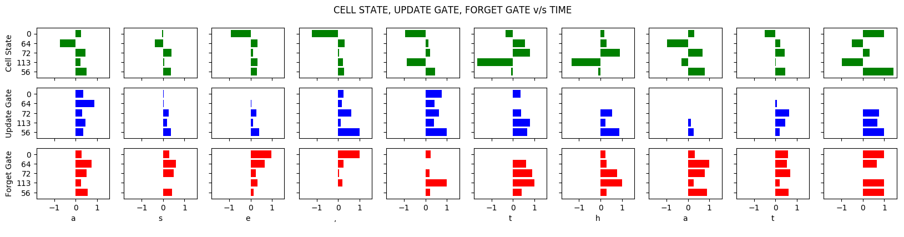
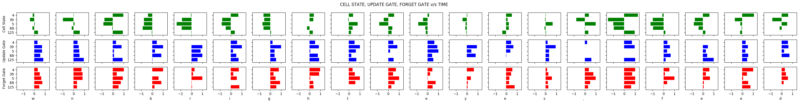

# AnalysisLSTM
Analysis of long term dependencies captured by LSTMs using a Character based language model.

### Results 

* More often than not the update gate and the forget gate are negatively correlated. 
* Cell states change drastically towards the end of a word. 
* States stay almost the same and/or uniformly across a word.
 

     

